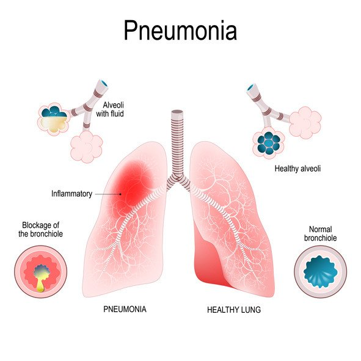
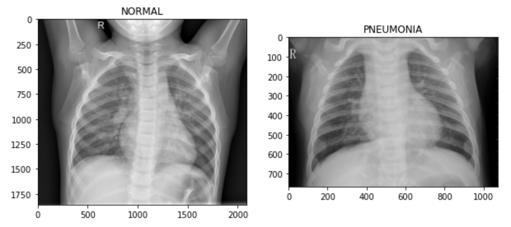
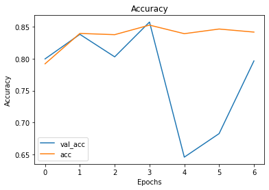
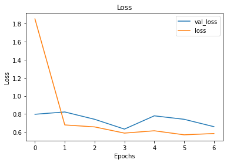

# Pneumonia Classification with Deep Learning
**Author**: [Jeremy Pagirsky](https://www.github.com/jeremypagirsky)



## Overview
The objective of this project is to build a deep learning model that is able to classify one's pneumonia diagnosis based on their chest x-ray. While a variety of diagnostic methods are utilized, chest x-rays are minimially invasive, fast, and comparatively less expensive. In conjunction with those benefits, robust AI tools may provide great potential for advancing prophylactic healthcare. This is especially pertinent to regions where there are a greater amount of barriers to accessing these resources.

## Data
About 6,000 x-ray images originated from [Kaggle](https://www.kaggle.com/paultimothymooney/chest-xray-pneumonia), split into training, testing, and validation directories.



## Methods
Two types of deep learning models have been tested and compared for accuracy and loss: Multilayer Perceptrons (MLPs) and Convolutional Neural Networks (CNNs). Baseline models have been constructed, compared, and further tuned to optimize loss, accuracy, and the extent of overfitting.

## Results
The tuned CNN produced a higher accuracy score (85.74%) compared to tuned MLPs with similar hyperparameters (62.50%). Loss for the tuned CNN was 0.63 while the loss for the MLP was 0.70.




## Future Work
As this is the first iteration of this project, further technical approaches toward optimization will be investigated. This project also has great implications for the COVID-19 pandemic and preventing the occurrence of future spikes in cases.

## For More Information

Please review the full analysis in the [CNN](./convolutional_nn.ipynb) and [MLP](./multilayer_perceptron.ipynb) Jupyter Notebooks or the [presentation](./xray_image_classification.pdf).

For any additional questions, please contact **Jeremy Pagirsky (jeremy.pagirsky@gmail.com)**

## Repository Structure

```
├── images                                     <- Images of final CNN accuracy and loss functions
├── README.md                                  <- The README for reviewers of this project
├── convolutional_nn.ipynb                     <- Code for convolutional neural network (CNN) models
├── multilayer_perceptron.ipynb                <- Code for multilayer perceptron models
└── xray_image_classification.pdf              <- PDF version of project presentation